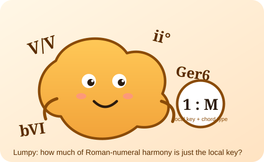

# Lumpy

**How much of Roman-numeral harmony is just the local key?**

Lumpy is a deterministic corpus study (zero LLM calls) with a small set of theorems. It asks a blunt question about harmonic analysis:
if you already know the *local key*, the *chord type*, and the *voice-leading geometry* of a progression, how many bits per chord does the
Roman-numeral label still add when predicting the next chord move?

Answer so far (188 classical movements, DCML corpora, leave-one-movement-out prequential coding):

| corpus | Roman label gain over global-key content | Roman residue beyond local-key content |
|---|---:|---:|
| Annotated Beethoven Corpus (string quartets, 70 mvts) | +0.45 to +0.52 bits/chord | 0.01 to 0.05 |
| Mozart piano sonatas (54 mvts) | +0.39 to +0.60 | 0.00 to 0.03 |
| Beethoven piano sonatas (64 mvts) | +0.45 to +0.58 | **0.11 to 0.13** |

So Roman labels are almost "lumpable" to (local scale degree, chord type) in two corpora, and carry a real extra 0.1 bit in the sonata corpus.
The residue survives root-free geometry, no event collapsing, a fixed target alphabet, and coder smoothing from 0.25 to 4; it halves when the
prediction target drops the current chord shape. Whichever corpus you train on, the sonata corpus keeps its residue.

Jazz contrast (Weimar Jazz Database, 456 solos, chord symbols): key-relative chord content improves next-move prediction by **2.4 bits/chord**,
five times the classical gain.

## What is in here
- `corpora.py` unified loaders (DCML TSV, WJazzD sqlite, music21 Bach chorales) -> one event schema
- `pilot_residue.py` the coding experiment (geometry / global-key / local-key / Roman contexts, KT and back-off coders)
- `controls_r3.py` robustness controls, `transfer.py` cross-corpus transfer, `residue_decompose.py` feature attribution + e-process, `jazz_contrast.py`
- `data/*.json` every number in the tables above, regenerable
- `PLAN.md` the preregistration-style plan, novelty record and kill rules
- `brand/lumpy.svg` the mascot

## Data and licenses
DCML corpora (ABC, mozart_piano_sonatas, beethoven_piano_sonatas): CC BY-NC-SA 4.0, https://github.com/DCMLab. Weimar Jazz Database: CC BY-NC-SA 3.0,
https://jazzomat.hfm-weimar.de. Bach chorales via music21's bundled corpus. This repository redistributes only derived counts and code.

## Status
Research in progress (2026-09). Target venue: a journal without a presentation requirement (TISMIR / Journal of Mathematics and Music).
Nothing here is peer reviewed yet. The mascot is friendly; the reviewers will not be.
